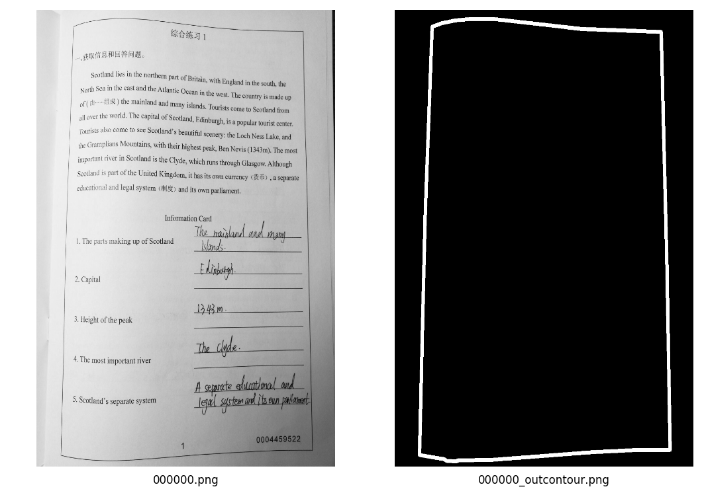
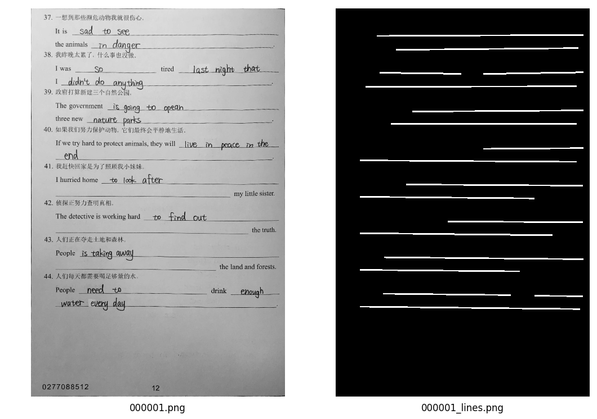

# BAGS
the Boxfish Automatic homework Grading System
## Framework

## Datasets
Two datasets are available in this repo. 

### Introduction to the Datasets
Dataset A is used for rectangular borderlines segmentation, which consists of 8500 pairs of images.
Dataset B is used for answer area underlines(AAU) segmentation, which consists of 8000 pairs of images.

There are one original grayscale image and  one tagged binary image corresponding to the gray image in a pair of images. 
They are named in this way: the original grayscale image is named as "***index***.png", and the tagged binary image is named as "***index***_outcontour.png"(for Dataset A) or "***index***_lines.png"(for Dataset B). 
"***Index***" is an integer type number with a constant length of 6 by adding leading zeros to the left of it.
They have the same formatted ***index*** in each pair.

### Examples
One example pair of dataset A. The original image is named as '000000.png'.And the tagged image is named as '000000_outcontour.png'.



One example pair of dataset B. The original image is named as '000001.png', and the tagged image is named as '000001_lines.png'.



### How to Download the Datasets
All the images（about 26.1GB） are stored in aliyun. You could download the two datasets as follow:
```sh
sh dataset/download_dataset.sh
```
or
```sh
python dataset/download_dataset.py
```
